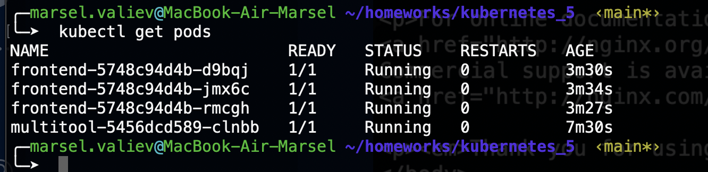
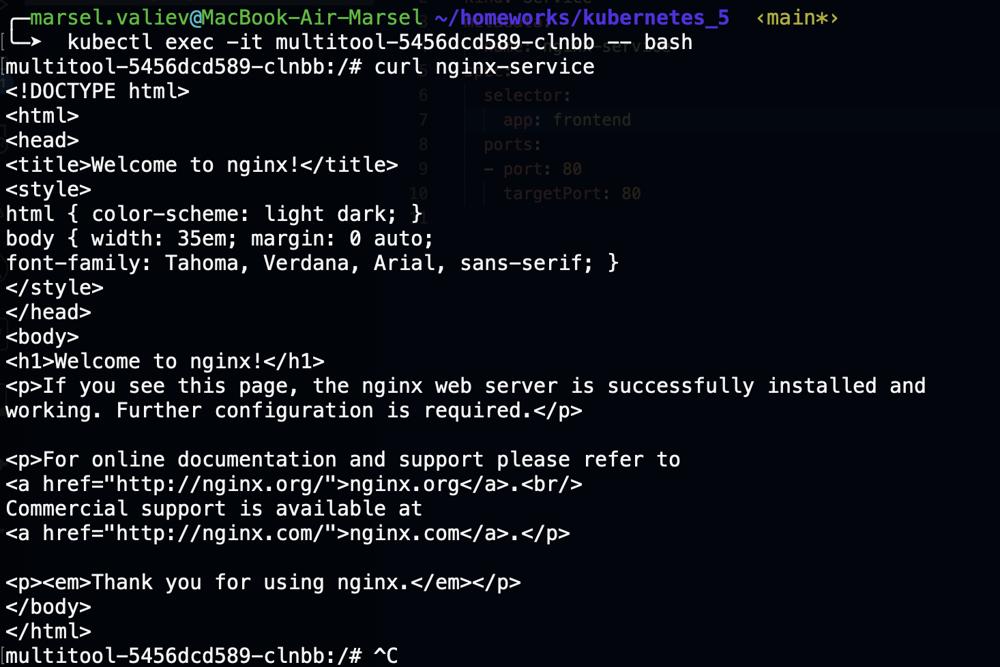
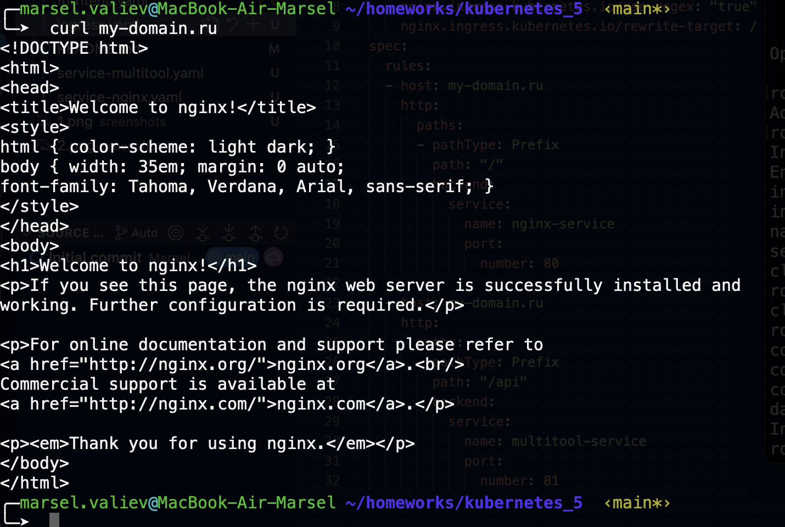
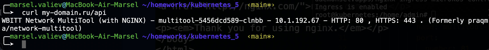

# Домашнее задание к занятию «Сетевое взаимодействие в K8S. Часть 2»

### Задание 1. Создать Deployment приложений backend и frontend

### Задание 2. Создать Ingress и обеспечить доступ к приложениям снаружи кластера

